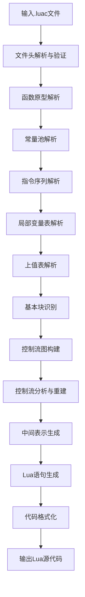
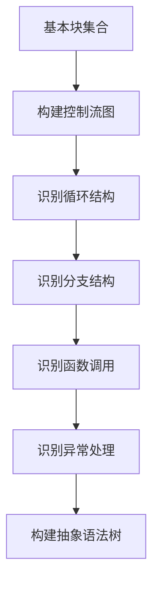

# Lua字节码反编译技术文档

## 1. 反编译环境搭建

### 1.1 必要依赖库

| 依赖库 | 版本 | 用途 | 安装命令 |
|-------|------|------|----------|
| Java | 8+ | 开发语言 | 官网下载安装 |
| Maven | 3.6+ | 项目构建 | 官网下载安装 |
| JUnit | 5+ | 单元测试 | `mvn dependency:add -DgroupId=org.junit.jupiter -DartifactId=junit-jupiter -Dversion=5.9.2` |
| Log4j2 | 2.20+ | 日志系统 | `mvn dependency:add -DgroupId=org.apache.logging.log4j -DartifactId=log4j-core -Dversion=2.20.0` |

### 1.2 项目结构

```
Relua/
├── src/
│   ├── main/
│   │   ├── java/
│   │   │   └── com/github/relua/
│   │   │       ├── ast/           # 抽象语法树定义
│   │   │       ├── decompiler/    # 反编译器核心
│   │   │       ├── parser/        # 字节码解析器
│   │   │       └── model/         # 数据模型
│   │   └── resources/             # 资源文件
│   └── test/                      # 测试代码
├── pom.xml                        # Maven配置
└── README.md                      # 项目说明
```

## 2. 字节码解析核心技术

### 2.1 文件头解析与验证技术

#### 2.1.1 Lua字节码文件结构

| 字段 | 大小 | 说明 |
|------|------|------|
| Magic Number | 4字节 | 魔数，固定为\x1BLua |
| Version | 1字节 | Lua版本号 |
| Format | 1字节 | 格式标识 |
| Endianness | 1字节 | 大小端标识 |
| Int Size | 1字节 | int类型大小 |
| SizeT Size | 1字节 | size_t类型大小 |
| Instruction Size | 1字节 | 指令大小 |
| Lua Number Size | 1字节 | Lua数字大小 |
| Integral Flag | 1字节 | 是否为整数 |
| Main Chunk | 可变 | 主代码块 |

#### 2.1.2 解析实现

```java
public void parseHeader(BinaryReader reader, LuacFile luacFile) throws IOException {
    // 读取魔数
    byte[] magicNumber = reader.readBytes(4);
    luacFile.setMagicNumber(magicNumber);
    
    // 验证魔数
    if (!isValidMagicNumber(magicNumber)) {
        throw new IOException("Invalid Lua magic number");
    }
    
    // 读取版本号
    byte version = reader.readByte();
    luacFile.setVersion(version);
    
    // 读取其他头信息...
}
```

### 2.2 函数原型(Proto)结构解析方法

#### 2.2.1 Proto结构定义

| 字段 | 类型 | 说明 |
|------|------|------|
| Source | string | 源文件名 |
| LineDefined | int | 函数定义行号 |
| LastLineDefined | int | 函数结束行号 |
| NumParams | int | 参数数量 |
| IsVararg | int | 是否为可变参数 |
| MaxStackSize | int | 最大栈大小 |
| Code | instruction[] | 指令序列 |
| Constants | constant[] | 常量池 |
| Upvalues | upvalue[] | 上值表 |
| Prototypes | Proto[] | 子函数原型 |
| LineInfo | int[] | 行号信息 |
| LocVars | locvar[] | 局部变量表 |
| UpvalueNames | string[] | 上值名称表 |

#### 2.2.2 解析算法

```java
public Chunk parseChunk(String function) throws IOException {
    Chunk chunk = new Chunk();
    chunk.setFunction(function);
    
    // 解析源文件名
    chunk.setSource(readString());
    
    // 解析行号信息
    chunk.setLineDefined(readInt());
    chunk.setLastLineDefined(readInt());
    
    // 解析参数和栈信息
    chunk.setNumParams(readByte());
    chunk.setIsVararg(readByte());
    chunk.setMaxStackSize(readByte());
    
    // 解析指令序列
    int instructionCount = readInt();
    for (int i = 0; i < instructionCount; i++) {
        chunk.addInstruction(parseInstruction());
    }
    
    // 解析常量池
    parseConstants(chunk);
    
    // 解析上值表
    parseUpvalues(chunk);
    
    // 解析子函数原型
    int subChunkCount = readInt();
    for (int i = 0; i < subChunkCount; i++) {
        chunk.addSubChunk(parseChunk("sub" + i));
    }
    
    // 解析行号信息
    parseLineInfo(chunk);
    
    // 解析局部变量表
    parseLocVars(chunk);
    
    // 解析上值名称表
    parseUpvalueNames(chunk);
    
    return chunk;
}
```

### 2.3 指令序列解析与转换技术

#### 2.3.1 Lua指令格式

Lua 5.1使用32位指令，主要有4种格式：

| 格式 | 位分配 | 示例 |
|------|--------|------|
| iABC | OP(6) A(8) B(9) C(9) | MOVE, LOADK, GETGLOBAL |
| iABx | OP(6) A(8) Bx(18) | JMP, GETTABUP, SETTABUP |
| iAsBx | OP(6) A(8) sBx(18) | FORLOOP, FORPREP, TFORLOOP |
| iAx | OP(6) Ax(26) | LOADKX |

#### 2.3.2 指令解析实现

```java
public Instruction parseInstruction() throws IOException {
    int instructionValue = readInt();
    Instruction instruction = new Instruction(instructionValue);
    
    // 解析指令类型
    int opcode = instruction.getOpcode();
    instruction.setOpcodeName(Opcode.getName(opcode));
    
    // 根据指令类型解析操作数
    switch (Opcode.getType(opcode)) {
        case iABC:
            instruction.setA((instructionValue >> 6) & 0xFF);
            instruction.setB((instructionValue >> 23) & 0x1FF);
            instruction.setC((instructionValue >> 14) & 0x1FF);
            break;
        case iABx:
            instruction.setA((instructionValue >> 6) & 0xFF);
            instruction.setBx(instructionValue >> 14);
            break;
        case iAsBx:
            instruction.setA((instructionValue >> 6) & 0xFF);
            instruction.setSBx((instructionValue >> 14) - 0x1FFFF);
            break;
        case iAx:
            instruction.setAx(instructionValue >> 6);
            break;
    }
    
    return instruction;
}
```

### 2.4 常量池(constants)解析与重建策略

#### 2.4.1 常量类型

| 类型 | 标识 | 示例 |
|------|------|------|
| Nil | 0 | nil |
| Boolean | 1 | true, false |
| Number | 3 | 123, 3.14 |
| String | 4 | "hello" |
| Table | 5 | {1, 2, 3} |
| Function | 6 | function() end |

#### 2.4.2 常量池解析实现

```java
private void parseConstants(Chunk chunk) throws IOException {
    int constantCount = readInt();
    for (int i = 0; i < constantCount; i++) {
        byte constantType = readByte();
        switch (constantType) {
            case 0: // Nil
                chunk.addConstant(new Constant(NilConst.getInstance()));
                break;
            case 1: // Boolean
                boolean value = readByte() != 0;
                chunk.addConstant(new Constant(value ? BooleanConst.TRUE : BooleanConst.FALSE));
                break;
            case 3: // Number
                double number = readDouble();
                chunk.addConstant(new Constant(number));
                break;
            case 4: // String
                String str = readString();
                chunk.addConstant(new Constant(str));
                break;
            // 其他类型处理...
        }
    }
}
```

### 2.5 局部变量表与上值(upvalues)处理技术

#### 2.5.1 局部变量表结构

| 字段 | 类型 | 说明 |
|------|------|------|
| VarName | string | 变量名 |
| StartPC | int | 变量生效的起始指令位置 |
| EndPC | int | 变量失效的结束指令位置 |
| Register | int | 变量所在的寄存器索引 |

#### 2.5.2 上值(upvalues)处理

```java
private void parseUpvalues(Chunk chunk) throws IOException {
    int upvalueCount = readInt();
    for (int i = 0; i < upvalueCount; i++) {
        byte inStack = readByte();
        byte idx = readByte();
        chunk.addUpvalue(new Upvalue(inStack, idx));
    }
}
```

## 3. 控制流分析与重建

### 3.1 基本块(Basic Block)识别算法

#### 3.1.1 基本块定义

基本块是一组连续的指令，满足：
1. 只有一个入口点，即第一个指令
2. 只有一个出口点，即最后一个指令
3. 执行时从第一个指令开始，直到最后一个指令结束

#### 3.1.2 基本块识别算法

```java
public List<BasicBlock> identifyBasicBlocks(List<Instruction> instructions) {
    List<BasicBlock> basicBlocks = new ArrayList<>();
    Set<Integer> leaders = new HashSet<>();
    
    // 第一个指令是leader
    leaders.add(0);
    
    // 寻找所有leader
    for (int i = 0; i < instructions.size(); i++) {
        Instruction instr = instructions.get(i);
        int opcode = instr.getOpcode();
        
        // 分支指令的目标地址是leader
        if (Opcode.isBranch(opcode)) {
            int target = getBranchTarget(instr);
            leaders.add(target);
            // 分支指令的下一条指令也是leader
            if (i + 1 < instructions.size()) {
                leaders.add(i + 1);
            }
        }
        // 其他可能产生新基本块的指令...
    }
    
    // 根据leaders构建基本块
    List<Integer> sortedLeaders = new ArrayList<>(leaders);
    Collections.sort(sortedLeaders);
    
    for (int i = 0; i < sortedLeaders.size(); i++) {
        int start = sortedLeaders.get(i);
        int end = (i + 1 < sortedLeaders.size()) ? sortedLeaders.get(i + 1) : instructions.size();
        BasicBlock block = new BasicBlock(start, end - 1);
        block.setInstructions(instructions.subList(start, end));
        basicBlocks.add(block);
    }
    
    return basicBlocks;
}
```

### 3.2 控制流图(CFG)构建技术

#### 3.2.1 CFG节点与边

- **节点**：表示基本块
- **边**：表示控制流转移
  - 有向边：从一个基本块指向另一个基本块
  - 类型：
    - 顺序边：基本块结束后直接执行下一个基本块
    - 条件分支边：根据条件跳转到不同的基本块
    - 无条件跳转边：直接跳转到指定基本块
    - 返回边：函数返回

#### 3.2.2 CFG构建算法

```java
public ControlFlowGraph buildCFG(List<BasicBlock> basicBlocks) {
    ControlFlowGraph cfg = new ControlFlowGraph();
    Map<Integer, BasicBlock> blockMap = new HashMap<>();
    
    // 构建基本块映射表
    for (BasicBlock block : basicBlocks) {
        blockMap.put(block.getStartPC(), block);
        cfg.addNode(block);
    }
    
    // 构建边
    for (BasicBlock block : basicBlocks) {
        Instruction lastInstr = block.getInstructions().get(block.getInstructions().size() - 1);
        int opcode = lastInstr.getOpcode();
        
        if (Opcode.isBranch(opcode)) {
            // 条件分支
            if (Opcode.isConditionalBranch(opcode)) {
                // 真分支
                int trueTarget = getTrueBranchTarget(lastInstr);
                cfg.addEdge(block, blockMap.get(trueTarget), EdgeType.CONDITIONAL_TRUE);
                // 假分支（下一个基本块）
                int falseTarget = block.getEndPC() + 1;
                if (blockMap.containsKey(falseTarget)) {
                    cfg.addEdge(block, blockMap.get(falseTarget), EdgeType.CONDITIONAL_FALSE);
                }
            } else {
                // 无条件分支
                int target = getBranchTarget(lastInstr);
                cfg.addEdge(block, blockMap.get(target), EdgeType.UNCONDITIONAL);
            }
        } else if (Opcode.isReturn(opcode)) {
            // 返回指令
            cfg.addEdge(block, null, EdgeType.RETURN);
        } else {
            // 顺序执行
            int nextPC = block.getEndPC() + 1;
            if (blockMap.containsKey(nextPC)) {
                cfg.addEdge(block, blockMap.get(nextPC), EdgeType.SEQUENTIAL);
            }
        }
    }
    
    return cfg;
}
```

### 3.3 分支结构(if-else、switch)识别与还原

#### 3.3.1 if-else结构识别

**识别条件**：
1. 存在条件分支指令（如 TESTSET, TEST, ISNIL, IS_EQ 等）
2. 分支目标指向的基本块是一个新的控制流起点
3. 存在对应的合并点（两个分支最终汇聚到同一个基本块）

**还原算法**：

```java
public IfStatement identifyIfStatement(BasicBlock block, ControlFlowGraph cfg) {
    Instruction lastInstr = block.getLastInstruction();
    if (!Opcode.isConditionalBranch(lastInstr.getOpcode())) {
        return null;
    }
    
    // 构建条件表达式
    Expression condition = buildConditionExpression(lastInstr);
    
    // 识别then分支
    BasicBlock thenBlock = cfg.getTrueSuccessor(block);
    Block thenBody = buildBlockBody(thenBlock, cfg);
    
    // 识别else分支
    BasicBlock elseBlock = cfg.getFalseSuccessor(block);
    Block elseBody = (elseBlock != null) ? buildBlockBody(elseBlock, cfg) : null;
    
    // 构建if-else语句
    return new IfStatement(condition, thenBody, elseBody);
}
```

#### 3.3.2 switch结构识别

**识别条件**：
1. 存在连续的条件比较指令（如 IS_EQ, IS_LT, IS_LE 等）
2. 所有分支指向不同的目标基本块
3. 存在统一的合并点

### 3.4 循环结构(for、while、repeat)识别与还原

#### 3.4.1 循环结构识别算法

**循环的基本特征**：
- 存在回边（从后向前的边）
- 存在循环入口和循环体
- 存在循环退出条件

**识别算法**：

```java
public LoopStatement identifyLoopStatement(BasicBlock block, ControlFlowGraph cfg) {
    // 检测回边
    Set<Edge> backEdges = findBackEdges(cfg);
    
    for (Edge edge : backEdges) {
        BasicBlock from = edge.getSource();
        BasicBlock to = edge.getTarget();
        
        // 确定循环入口和循环体
        BasicBlock loopEntry = to;
        List<BasicBlock> loopBody = findLoopBody(loopEntry, from, cfg);
        
        // 识别循环类型
        LoopType type = determineLoopType(loopEntry, loopBody, edge);
        
        // 根据循环类型构建对应的循环语句
        switch (type) {
            case FOR_NUMERIC:
                return buildForNumericLoop(loopEntry, loopBody);
            case FOR_IN:
                return buildForInLoop(loopEntry, loopBody);
            case WHILE:
                return buildWhileLoop(loopEntry, loopBody);
            case REPEAT:
                return buildRepeatLoop(loopEntry, loopBody);
        }
    }
    
    return null;
}
```

### 3.5 异常处理结构(try-catch)解析技术

Lua 5.1原生不支持try-catch结构，但某些Lua扩展或编译器可能会生成类似的字节码。异常处理结构的识别主要基于以下特征：

1. 存在特定的异常检测指令
2. 存在异常处理入口点
3. 存在异常清理代码

## 4. 代码生成技术

### 4.1 中间表示(IR)设计与实现

#### 4.1.1 IR设计原则

- **简洁性**：使用尽可能简单的操作符和结构
- **表达能力**：能够表示所有Lua语言结构
- **易于转换**：便于从字节码指令转换，也便于转换为目标代码
- **便于分析**：支持控制流分析、数据流分析等优化

#### 4.1.2 IR基本结构

```java
public class IRInstruction {
    private IROpcode opcode;
    private List<IRExpr> operands;
    private int resultRegister;
    private int lineNumber;
    
    // getter和setter方法...
}

public enum IROpcode {
    MOVE, LOAD_CONST, ADD, SUB, MUL, DIV, CALL, RETURN, 
    JMP, CJMP, LOOP, FOR_PREP, FOR_LOOP, TFOR_LOOP
    // 其他操作符...
}
```

### 4.2 从指令序列到Lua语句的转换规则

#### 4.2.1 赋值语句转换

| 字节码指令 | Lua语句 | 转换规则 |
|------------|---------|----------|
| MOVE A B | local varA = varB | 将寄存器B的值赋给寄存器A，转换为局部变量赋值 |
| GETGLOBAL A Bx | local varA = globalBx | 从全局表获取变量，转换为全局变量访问 |
| SETGLOBAL A Bx | globalBx = varA | 将寄存器A的值赋给全局变量，转换为全局变量赋值 |
| GETTABLE A B C | local varA = varB[varC] | 从表中获取元素，转换为表索引访问 |
| SETTABLE A B C | varB[varC] = varA | 将值存入表中，转换为表索引赋值 |

#### 4.2.2 函数调用转换

| 字节码指令 | Lua语句 | 转换规则 |
|------------|---------|----------|
| CALL A B C | varA = funcB(args...) | 函数调用，A为返回值寄存器，B为函数寄存器，C为参数数量 |
| RETURN A B | return varA, varA+1, ... | 函数返回，A为返回值起始寄存器，B为返回值数量 |

### 4.3 表达式重建算法

表达式重建的核心是从指令序列中识别出表达式结构，并将其转换为Lua表达式。主要算法包括：

1. **递归下降重建**：从根节点开始，递归地构建表达式树
2. **基于优先级的重建**：根据操作符优先级构建表达式
3. **基于数据流的重建**：分析变量的数据流，构建表达式

```java
public Expression rebuildExpression(RegisterState state, int register) {
    // 获取寄存器的定义指令
    Instruction defInstr = state.getDefinitionInstruction(register);
    if (defInstr == null) {
        return new Name(getRegisterName(register));
    }
    
    int opcode = defInstr.getOpcode();
    switch (opcode) {
        case Opcode.LOADK:
            // 加载常量
            Constant constant = chunk.getConstants().get(defInstr.getBx());
            return buildConstantExpression(constant);
        case Opcode.ADD:
        case Opcode.SUB:
        case Opcode.MUL:
        case Opcode.DIV:
            // 二元运算
            Expression left = rebuildExpression(state, defInstr.getB());
            Expression right = rebuildExpression(state, defInstr.getC());
            BinaryOp.Operator operator = getBinaryOperator(opcode);
            return new BinaryOp(left, operator, right);
        case Opcode.CALL:
            // 函数调用
            Expression func = rebuildExpression(state, defInstr.getB());
            List<Expression> args = new ArrayList<>();
            for (int i = defInstr.getB() + 1; i < defInstr.getB() + defInstr.getC(); i++) {
                args.add(rebuildExpression(state, i));
            }
            return new FunctionCall(func, args);
        // 其他指令处理...
        default:
            return new Name(getRegisterName(register));
    }
}
```

### 4.4 函数定义与调用还原技术

#### 4.4.1 函数定义还原

```java
public FunctionDeclaration rebuildFunctionDefinition(Chunk chunk) {
    // 构建函数参数列表
    List<String> params = new ArrayList<>();
    for (int i = 0; i < chunk.getNumParams(); i++) {
        params.add(chunk.getLocVars().get(i).getVarName());
    }
    if (chunk.getIsVararg() != 0) {
        params.add("...");
    }
    
    // 构建函数体
    Block body = rebuildBlockBody(chunk);
    
    // 构建函数定义
    FunctionLiteral funcLit = new FunctionLiteral(params, chunk.getIsVararg() != 0, body);
    return new FunctionDeclaration(chunk.getFunction(), funcLit);
}
```

#### 4.4.2 函数调用还原

```java
public FunctionCall rebuildFunctionCall(Instruction instr, Chunk chunk, RegisterState state) {
    // 获取函数表达式
    Expression func = rebuildExpression(state, instr.getB());
    
    // 构建参数列表
    List<Expression> args = new ArrayList<>();
    int numArgs = instr.getC() - 1;
    for (int i = 0; i < numArgs; i++) {
        args.add(rebuildExpression(state, instr.getB() + 1 + i));
    }
    
    // 构建函数调用
    return new FunctionCall(func, args);
}
```

### 4.5 代码格式化与可读性优化方法

1. **缩进处理**：根据控制流深度添加适当的缩进
2. **换行处理**：在适当的位置添加换行，如语句结束、控制流结构开始和结束
3. **空格处理**：在操作符、逗号、分号等前后添加适当的空格
4. **括号优化**：移除不必要的括号，保留必要的括号以确保运算顺序
5. **变量命名优化**：使用有意义的变量名，避免单个字母变量（除了循环变量）
6. **注释添加**：在关键代码段添加注释，说明代码功能

## 5. 高级反编译技术

### 5.1 反混淆技术

#### 5.1.1 常量加密识别与还原

**识别特征**：
- 存在大量的加密/解密函数调用
- 常量池中有异常多的字符串或数字常量
- 指令序列中存在大量的位运算、算术运算等加密操作

**还原方法**：
1. 动态执行解密函数，获取原始常量
2. 静态分析解密算法，重建解密函数
3. 将解密后的常量替换回代码中

#### 5.1.2 控制流平坦化识别与还原

**识别特征**：
- 存在一个主循环，通过跳转表控制程序流程
- 基本块之间的控制流关系复杂，难以直接理解
- 存在大量的无条件跳转指令

**还原方法**：
1. 识别主循环和跳转表
2. 分析跳转表，确定原始控制流顺序
3. 重新组织基本块，恢复原始控制流结构
4. 移除主循环和跳转表

#### 5.1.3 虚假控制流识别与还原

**识别特征**：
- 存在不可达的基本块
- 存在总是为真或总是为假的条件分支
- 存在冗余的跳转指令

**还原方法**：
1. 使用数据流分析识别不可达代码
2. 简化总是为真或总是为假的条件表达式
3. 移除冗余的跳转指令
4. 合并相邻的基本块

### 5.2 反调试保护的绕过方法

1. **检测调试器存在的指令识别**：识别并移除检测调试器的指令
2. **时间检查绕过**：修改或移除时间检查指令，或模拟正常的执行时间
3. **断点检测绕过**：识别并移除断点检测指令
4. **内存检查绕过**：修改或移除内存完整性检查指令

### 5.3 字节码优化痕迹的识别与处理

1. **常量折叠识别**：识别编译时进行的常量折叠优化，还原原始表达式
2. **死代码消除识别**：识别并恢复被编译器消除的死代码
3. **内联函数识别**：识别被内联的函数调用，恢复函数调用结构
4. **循环展开识别**：识别被展开的循环，恢复原始循环结构

### 5.4 复杂数据结构的重建技术

1. **表结构重建**：识别表的创建和初始化指令，重建完整的表结构
2. **数组结构重建**：识别数组的创建和初始化指令，重建完整的数组结构
3. **对象结构重建**：识别类/对象的创建和方法调用，重建面向对象结构
4. **闭包结构重建**：识别闭包的创建和上值访问，重建闭包结构

## 6. 验证与测试方法

### 6.1 反编译代码正确性验证流程

1. **语法验证**：使用Lua解释器检查反编译后的代码是否语法正确
2. **语义验证**：执行反编译后的代码，检查是否产生预期结果
3. **功能验证**：测试反编译代码的各项功能是否与原始代码一致
4. **性能验证**：比较反编译代码与原始代码的执行性能

### 6.2 字节码与反编译代码的一致性测试方法

1. **双向验证**：
   - 将原始Lua代码编译为字节码
   - 反编译字节码得到Lua代码
   - 再次编译反编译后的Lua代码
   - 比较两次编译得到的字节码是否一致

2. **动态测试**：
   - 为原始Lua代码编写测试用例
   - 执行原始Lua代码，记录测试结果
   - 执行反编译后的Lua代码，记录测试结果
   - 比较两次测试结果是否一致

### 6.3 异常情况处理与边界测试

1. **异常情况测试**：
   - 空字节码文件
   - 损坏的字节码文件
   - 不支持的Lua版本
   - 包含未实现指令的字节码

2. **边界测试**：
   - 极大或极小的常量值
   - 深度嵌套的控制流结构
   - 大量的局部变量
   - 复杂的表达式

### 6.4 性能优化与效率提升策略

1. **算法优化**：
   - 使用更高效的基本块识别算法
   - 优化控制流图构建算法
   - 使用高效的表达式重建算法

2. **数据结构优化**：
   - 使用更高效的数据结构存储基本块和控制流图
   - 优化寄存器状态管理
   - 使用缓存机制减少重复计算

3. **并行处理**：
   - 并行解析多个函数原型
   - 并行构建多个基本块
   - 并行生成多个函数的代码

## 7. 实现流程图

### 7.1 反编译整体流程



### 7.2 控制流分析与重建流程



## 8. 关键算法伪代码

### 8.1 基本块识别算法伪代码

```
function identify_basic_blocks(instructions)
    leaders = set containing 0
    
    for i from 0 to len(instructions) - 1:
        instr = instructions[i]
        if is_branch(instr):
            target = get_branch_target(instr)
            add target to leaders
            if i + 1 < len(instructions):
                add i + 1 to leaders
        
    sorted_leaders = sort(leaders)
    basic_blocks = []
    
    for i from 0 to len(sorted_leaders) - 1:
        start = sorted_leaders[i]
        end = sorted_leaders[i + 1] if i + 1 < len(sorted_leaders) else len(instructions)
        block = BasicBlock(start, end - 1)
        block.instructions = instructions[start:end]
        add block to basic_blocks
    
    return basic_blocks
end
```

### 8.2 控制流图构建算法伪代码

```
function build_cfg(basic_blocks)
    cfg = ControlFlowGraph()
    block_map = {}
    
    for block in basic_blocks:
        block_map[block.start] = block
        add block to cfg.nodes
    
    for block in basic_blocks:
        last_instr = block.instructions[-1]
        
        if is_branch(last_instr):
            if is_conditional_branch(last_instr):
                true_target = get_true_target(last_instr)
                add_edge(cfg, block, block_map[true_target], CONDITIONAL_TRUE)
                
                false_target = block.end + 1
                if false_target in block_map:
                    add_edge(cfg, block, block_map[false_target], CONDITIONAL_FALSE)
            else:
                target = get_branch_target(last_instr)
                add_edge(cfg, block, block_map[target], UNCONDITIONAL)
        elif is_return(last_instr):
            add_edge(cfg, block, null, RETURN)
        else:
            next_pc = block.end + 1
            if next_pc in block_map:
                add_edge(cfg, block, block_map[next_pc], SEQUENTIAL)
    
    return cfg
end
```

### 8.3 表达式重建算法伪代码

```
function rebuild_expression(state, register)
    def_instr = state.get_definition_instruction(register)
    if def_instr is null:
        return Name(get_register_name(register))
    
    opcode = def_instr.opcode
    
    if opcode == LOADK:
        constant = get_constant(def_instr.Bx)
        return build_constant_expression(constant)
    elif is_binary_op(opcode):
        left = rebuild_expression(state, def_instr.B)
        right = rebuild_expression(state, def_instr.C)
        operator = get_binary_operator(opcode)
        return BinaryOp(left, operator, right)
    elif opcode == CALL:
        func = rebuild_expression(state, def_instr.B)
        args = []
        for i from 0 to def_instr.C - 2:
            arg = rebuild_expression(state, def_instr.B + 1 + i)
            add arg to args
        return FunctionCall(func, args)
    else:
        return Name(get_register_name(register))
end
```

## 9. 技术实现关键点总结

1. **字节码解析**：准确解析Lua字节码文件格式，包括文件头、函数原型、指令序列等
2. **控制流分析**：准确识别基本块和控制流图，为后续的代码生成奠定基础
3. **表达式重建**：从寄存器操作中重建复杂的表达式结构
4. **控制流重建**：识别并还原各种控制流结构，如if-else、循环等
5. **代码生成**：生成可读性高、结构清晰的Lua代码
6. **反混淆处理**：识别并还原各种混淆技术，提高反编译代码的可读性
7. **测试与验证**：确保反编译代码的正确性和完整性

## 10. 未来发展方向

1. **支持更多Lua版本**：扩展支持Lua 5.2、5.3、5.4等新版本
2. **提高反编译精度**：优化控制流分析和表达式重建算法，提高反编译代码的准确性
3. **增强反混淆能力**：支持更多类型的混淆技术，提高反编译代码的可读性
4. **提高性能**：优化算法和数据结构，提高反编译速度
5. **支持更多平台**：支持Android、iOS等移动平台的Lua字节码
6. **图形化界面优化**：提供更友好、更强大的图形化界面，方便用户使用
7. **插件系统**：支持插件扩展，方便用户自定义反编译规则和功能

## 11. 参考文献

1. Lua 5.1 Reference Manual
2. Lua 5.1 Bytecode Reference
3. "Reverse Engineering Lua Bytecode" by Kein-Hong Man
4. "Lua Decompiler Design and Implementation" by Egor Skriptunoff
5. "Control Flow Analysis of Computer Programs" by Frances E. Allen
6. "Compiler Construction: Principles and Practice" by Kenneth C. Louden

## 12. 附录

### 12.1 Lua 5.1 指令集参考

| 指令码 | 指令名 | 格式 | 功能描述 |
|--------|--------|------|----------|
| 0 | MOVE | iABC | 将寄存器B的值赋给寄存器A |
| 1 | LOADK | iABx | 将常量Bx加载到寄存器A |
| 2 | LOADBOOL | iABC | 将布尔值加载到寄存器A |
| 3 | LOADNIL | iABC | 将nil加载到寄存器A及后续寄存器 |
| 4 | GETUPVAL | iABC | 从upvalue表中获取值到寄存器A |
| 5 | GETGLOBAL | iABx | 从全局表中获取值到寄存器A |
| 6 | GETTABLE | iABC | 从表中获取元素到寄存器A |
| 7 | SETGLOBAL | iABx | 将寄存器A的值赋给全局变量 |
| 8 | SETUPVAL | iABC | 将寄存器A的值赋给upvalue |
| 9 | SETTABLE | iABC | 将寄存器A的值赋给表元素 |
| 10 | NEWTABLE | iABC | 创建新表到寄存器A |
| 11 | SELF | iABC | 处理对象方法调用的self参数 |
| 12 | ADD | iABC | 寄存器B和C相加，结果存入寄存器A |
| 13 | SUB | iABC | 寄存器B减去C，结果存入寄存器A |
| 14 | MUL | iABC | 寄存器B和C相乘，结果存入寄存器A |
| 15 | DIV | iABC | 寄存器B除以C，结果存入寄存器A |
| 16 | MOD | iABC | 寄存器B取模C，结果存入寄存器A |
| 17 | POW | iABC | 寄存器B的C次方，结果存入寄存器A |
| 18 | UNM | iABC | 寄存器B取反，结果存入寄存器A |
| 19 | NOT | iABC | 寄存器B逻辑非，结果存入寄存器A |
| 20 | LEN | iABC | 寄存器B的长度，结果存入寄存器A |
| 21 | CONCAT | iABC | 连接寄存器B到C的值，结果存入寄存器A |
| 22 | JMP | iAsBx | 无条件跳转到偏移sBx |
| 23 | EQ | iABC | 比较寄存器B和C是否相等，结果影响跳转 |
| 24 | LT | iABC | 比较寄存器B是否小于C，结果影响跳转 |
| 25 | LE | iABC | 比较寄存器B是否小于等于C，结果影响跳转 |
| 26 | TEST | iABC | 测试寄存器A的值，结果影响跳转 |
| 27 | TESTSET | iABC | 测试寄存器C的值，结果存入寄存器A并影响跳转 |
| 28 | CALL | iABC | 调用寄存器A指向的函数 |
| 29 | TAILCALL | iABC | 尾调用寄存器A指向的函数 |
| 30 | RETURN | iABC | 函数返回 |
| 31 | FORLOOP | iAsBx | for循环迭代 |
| 32 | FORPREP | iAsBx | for循环准备 |
| 33 | TFORLOOP | iABC | 泛型for循环迭代 |
| 34 | SETLIST | iABC | 将寄存器列表存入表中 |
| 35 | CLOSE | iABC | 关闭upvalue |
| 36 | CLOSURE | iABx | 创建闭包到寄存器A |
| 37 | VARARG | iABC | 处理可变参数 |

### 12.2 常用数据结构定义

```java
// 基本块定义
public class BasicBlock {
    private int startPC;
    private int endPC;
    private List<Instruction> instructions;
    private Set<BasicBlock> predecessors;
    private Set<BasicBlock> successors;
    // getter和setter方法...
}

// 控制流图定义
public class ControlFlowGraph {
    private Set<BasicBlock> nodes;
    private Set<Edge> edges;
    private BasicBlock entryBlock;
    private Set<BasicBlock> exitBlocks;
    // 方法定义...
}

// 控制流边定义
public class Edge {
    private BasicBlock source;
    private BasicBlock target;
    private EdgeType type;
    // getter和setter方法...
}

// 边类型枚举
public enum EdgeType {
    SEQUENTIAL, CONDITIONAL_TRUE, CONDITIONAL_FALSE, UNCONDITIONAL, RETURN
}
```

## 13. 免责声明

本技术文档仅用于学习和研究目的，请勿用于非法用途。使用本文档中描述的技术产生的一切后果由使用者自行承担。

---

**文档版本**：v1.0
**创建日期**：2025-12-12
**作者**：Relua开发团队
**版权所有**：© 2025 Relua开发团队